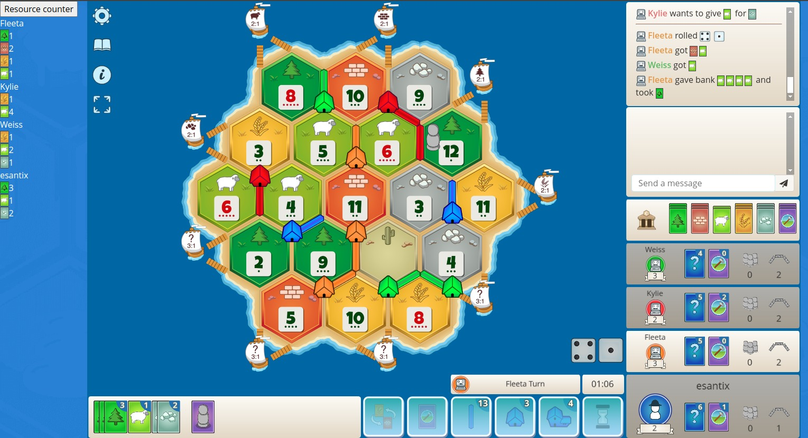

# Colonist resource counter
Chrome extention for Colonit.io

Keeps count of user resources by log inspection

## Usage

- Open chrome://extensions/
- Enable developer mode
- Load unpacked
- Select **src/** folder
- Once game starts click on **Resource counter** button (See image)
