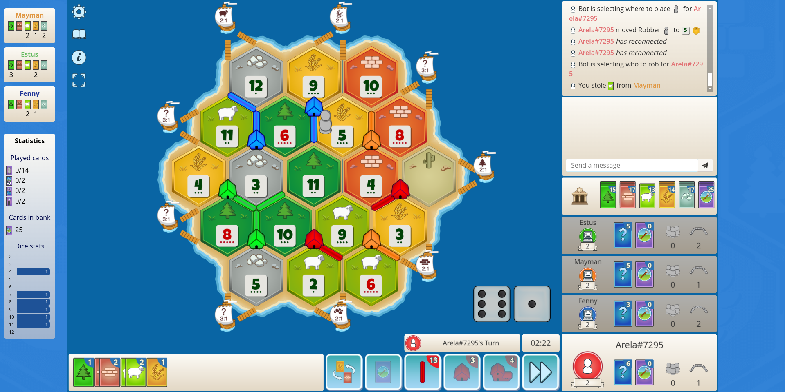

# Colonist.io log parser
Chrome extention for [Colonist.io](https://colonist.io/) game.

## DISCLAIMER

#### Currently works for 1v1 without trade. Trade is private so count will loose track of cards.

## Description
Parses public log and displays data on charts. Also hides ads. 

**Disclaimer 1**: Review Colonist supported version before using. Log UI and messages might change altering completely the count of resources. 

**Disclaimer 2**: Trade with Unknown Card [?] makes exact calculations imposible. Same when stealing cards between other players

## Installation (developer mode)

- Download latest release asset https://github.com/esantix/colonist-ext/releases/latest
- Unzip file 
- Open Chrome Extensions Manager [chrome://extensions/](chrome://extensions/)
- Enable **developer mode**
- Choose **Load unpacked**
- Select **src/** folder from unzipped path

## Collaboration

This project is aimed for public use. It was intentionally made as a challenge and is open for improvements. There is no linkage with the colonist.io owners/developers. If interested in collaborating contact me at santiago93echevarria@gmail.com
