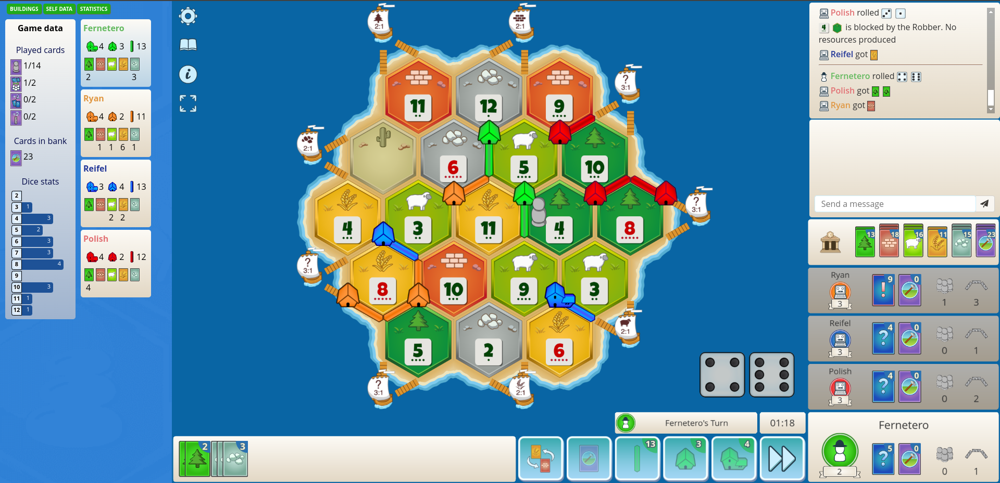

# Colonist.io log parser
Chrome extention for colonist.io

## Description
Parses public log and displays data on charts. 

**Disclaimer 1**: Review colonist supported version before using. Log UI and messages might change altering completely the count of resources. 

**Disclaimer 2**: Trade with Unknown Card [?] makes exact calculations imposible. 

## Installation

- Download latest release asset https://github.com/esantix/colonist-ext/releases/latest
- Unzip file 
- Open Chrome Extensions Manager [chrome://extensions/](chrome://extensions/)
- Enable **developer mode**
- Choose **Load unpacked**
- Select **src/** folder from unzipped path

